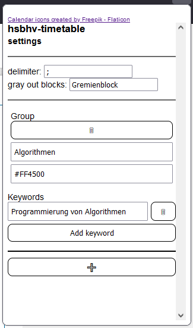

# Timetable browser extension for the University of Applied Sciences Bremerhaven

## O++ S+ !I C E- M V D++
(more about maintenance and what you can expect from me or the project down below)

## How does it work?

The idea was to make the timetable fit a bit better on the screen and visualize the different types of events, so they can be distinguished easier.

As the timetables are not personalized it happens to be filled with a lot of events that you will never attend. So to tidy up your timetable you can select keywords that identify a single or multiple events at once and gray them out.

This can be done by selecting the keywords followed by a right-click to open the context-menu. In the context-menu you can then click on "Add selection to removed blocks". After that the timetable will be updated.

Another way to add keywords is to open the extension-popup by clicking on the timetable-icon in the top-right corner of your browser. You can then insert the keywords into the input field. To enter multiple keywords you have to separate them by a delimiter that u can also input via an input field. After clicking outside the input fields the changes are saved and the timetable will be updated.

## What can you expect from this project?

This project is my first browser extension so there could be fundamental mistakes in the code. So if you spot something that is usually not done that way feel free to open an issue.
The same obviously applies to bugs.
As this is more of a fun project it can take some time until bugs are fixed and a new version is released. 

Although this is a fun project and I do not have a roadmap of features or something similar you can always open an issue with a feature suggestion.